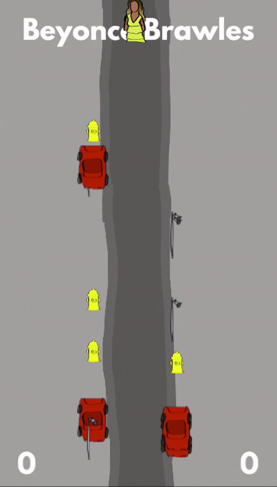

# Beyoncé Brawles

A little 2d game inspired by Beyoncé's music video to *Hold Up*

## Written in Rust with ggez

[ggez](http://ggez.rs/) is a 2d game library which is very nice to work with!

To run the game locally clone this repo, cd into it and run `$ cargo build` to build it.
Then copy the `/resources` folder over to the created `target/debug/` folder.
This is where the game will look for its asstes. You only have to do this once.

After that you can run `$ cargo run` to run the game.

## Contributing

If you find something you'd like to fix or improve, feel free to open a ticket and `@`-mention me direclty.

If it's a small fix I might do it right away but it can also take days, weeks or months. Sorry about that, but this is a hobby project after all.

If you want to fix a thing by yourself the same approach applies but with a PR.

## CREDITS

Sounds from  
https://freesound.org/people/Mrguff/sounds/369711/  
https://freesound.org/people/bradwesson/sounds/135936/  
https://freesound.org/people/SamsterBirdies/sounds/363920/  
http://freesound.org/people/CosmicEmbers/sounds/160756/  
